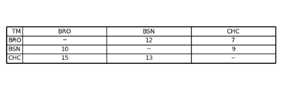

# SR_APP
## Application For Sports Reference

This is my solution for the Engineering Internship Prompt

I've taken the liberty of using a couple python libraries making things easier (Pandas,Json, and Matplotlib)

To start I simply used the json library to read in a json file.

Next I converted it into a dictionary since a json object is essentially a dictionary and dictionaries are far easier to work with in python.

Next I converted the dictionary into a pandas data frame. I did this because our final output needs to be a table/data frame and the pandas library is a great tool
to manipulate data frames. This could also have been done simply using a 2d array/list but, pandas just makes everything look and operate more smoothly.

The first issue I came across was what happens when a team plays itself. This is obviously a null value, because it can't happen, so I simply replaced all NA values with --.

The next thing I had to do was get the correct win value in each cell. At this stage each cell looked somewhat like this e.x) [ { W:10, L:5 } ]. Each cell contained a dictionary of wins and losses. To get only the wins value I first had to loop through each cell using a nested for loop. Then in each cell if the value was --, I ignored it because it was already correct. If it was a dictionary I got both the W and L values of the dictionary. Then I converted that object into a list which allowed me to grab only the win value since it always appears first. If that wasn't the case then you would need to simply add an If statement that basically checks for the W key value.

After the for loop ends the data frame is complete and looks as it should.

I wasn't sure if it was required, but I created a sample output using a mock json file and matplotlib to create a table which can be seen below

### Output Created by example json file

Thank you for taking the time to look at this I really appreciate it.
